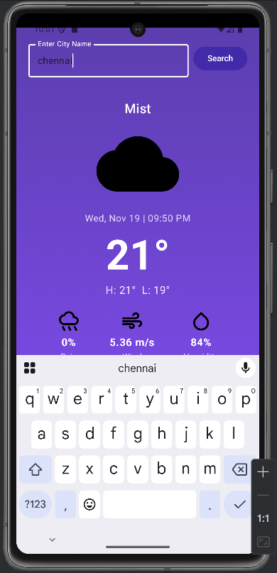
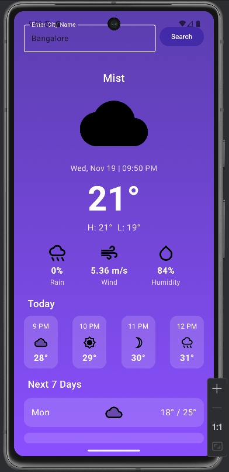

# Weather App - Android (Jetpack Compose)

A real-time weather application built using Kotlin and Jetpack Compose.

## Features
- Live weather using OpenWeatherMap API
- Search by city
- Temperature, humidity, wind speed
- Modern gradient UI
- MVVM Architecture

## Tech Stack
- Kotlin
- Jetpack Compose
- Retrofit
- Coroutines & Flow
- MVVM

## Screenshots
### Search Feature

### Weather Result

